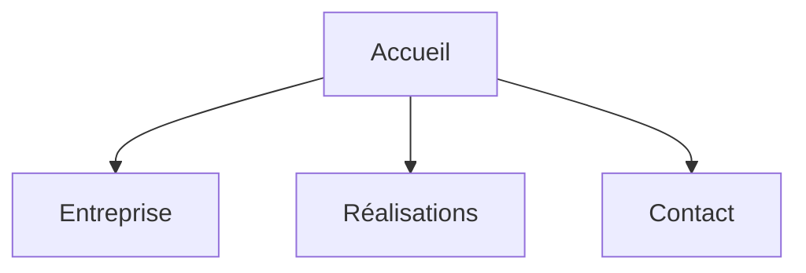

# BloomPetals - Site vitrine professionnel


Site vitrine statique développé en HTML/CSS simulant une présence web professionnelle pour une entreprise florale.

---

## Résumé exécutif

Conception d’un site web multi-pages permettant de présenter une activité commerciale (BloomPetals) avec une structure claire, une navigation cohérente et une identité visuelle homogène.

Objectif : démontrer des compétences en **intégration web**, **structuration front-end** et **mise en valeur d’un contenu métier**.

---

## Périmètre technique

* HTML5
* CSS3
* Architecture multi-pages
* Design responsive basique

---

## Réalisations clés

* Développement d’un site vitrine structuré en plusieurs pages
* Mise en place d’une navigation cohérente entre les sections
* Création d’une identité visuelle uniforme (CSS centralisé)
* Organisation du contenu pour une lecture claire et intuitive
* Mise en valeur d’une activité professionnelle fictive

---

## Architecture du site



---

## Fonctionnalités

* Page d’accueil présentant l’univers BloomPetals
* Page entreprise (présentation de l’activité)
* Page réalisations (mise en avant des créations)
* Page contact
* Navigation fluide entre les pages
* Design cohérent via une feuille CSS commune

---

## Structure du projet

```text
Bloompetals/
│
├── index.html
├── entreprise.html
├── realisation.html
├── contact.html
├── styleflower.css
├── Bloompetals.pdf
└── README.md
```

---

## Exécution

Aucune installation requise.

Ouvrir simplement :

```bash
index.html
```

---

## Compétences démontrées

* Intégration web (HTML/CSS)
* Structuration d’un site multi-pages
* Gestion de styles centralisés (CSS)
* Conception d’interface utilisateur simple
* Organisation du contenu et hiérarchie visuelle

---

## Limites

* Site statique (pas de back-end)
* Pas de base de données
* Pas de JavaScript avancé
* Formulaire non fonctionnel côté serveur

---

## Valeur professionnelle

Ce projet démontre la capacité à :

* Concevoir un site vitrine fonctionnel
* Structurer un projet front-end simple
* Créer une interface claire et exploitable
* Traduire un besoin métier en interface web

---

## Documentation

Le fichier `Bloompetals.pdf` contient les éléments complémentaires du projet.

---

## Auteur

Alexis Noiret
Étudiant en cybersécurité
